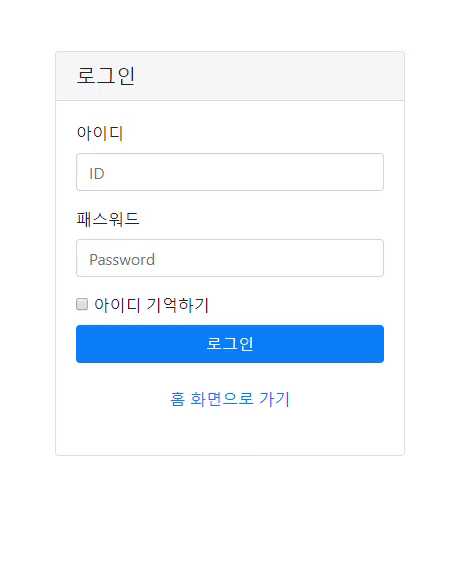

## SpringSecurity를 활용하여 로그인 실패 시 처리돼야 할 프로세스를 관리할 수 있다.

### 1. Exception에 따라 적절한 에러메시지를 설정할 수 있다.
### 2. 올바르지않은 PW를 입력한 ID의 경우에는 실패횟수를 증가시켜, 5회이상 실패 시 계정이 잠기도록 할 수 있다.

#### 로그인 실패 후속처리 Class : [ [ LoginFailureHandler ] ](https://github.com/Taesan94/OurNeighborhoodEvent/blob/master/src/main/java/woodong2/handler/security/LoginFailureHandler.java)

- 로그인 실패 처리기능을 제공하고있는 AuthenticationFailureHandler 인터페이스 구현클래스를 정의한다.
- 전역변수로 로그인 form의 id,pw의 name속성 값, 예외처리 메시지를 Attribute에 저장하기위한 key값, 로그인 실패시 이동할 defaultUrl을 선언해준다.
- 해당 전역변수의 초기값들은 security설정으로 분리한다.
```
<beans:bean id="loginFailureHandler" class="woodong2.handler.security.LoginFailureHandler">
    <beans:property name="username" value="username"/>
    <beans:property name="password" value="password"/>
    <beans:property name="exceptionMsgName" value="exceptionMsgName"/>
    <beans:property name="defaultFailureUrl" value="/com/loginPage.do?error"/>
</beans:bean>
```

- onAuthenticationFailure 메서드를 Override한다.
- onAuthenticationFailure 메서드의 3번째 인자 값 AuthenticationException클래스 참조변수를 활용해 예외 클래스의 타입을 확인한다.
- 예외 메시지는 하드코딩하지않고 MessageSource인터페이스를 활용하여 properties파일에 정의된 key값을 통해 가져온다.<a href="https://github.com/Taesan94/OurNeighborhoodEvent/blob/master/src/main/webapp/WEB-INF/config/message/security_message.properties">[ security_message.properties ]</a>
- 에러메시지는 로그인 폼 하단에 출력된다.

### 결과확인


