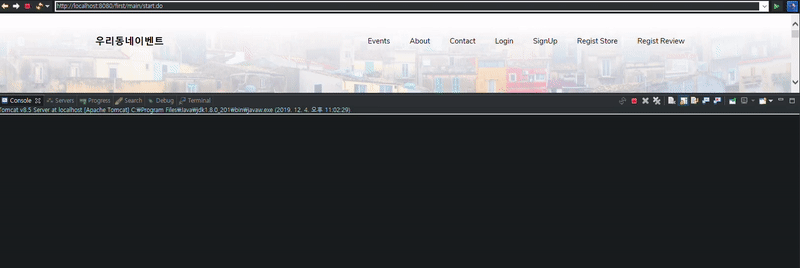

## 가게등록, 이벤트등록, 리뷰등록시 Interceptor를 활용한 로그인 세션처리

### action-servlet.xml 파일에 Interceptor처리 할 패턴지정

```
  <mvc:interceptor>
    <mvc:mapping path="/*/regist*Page.do" />
    <bean id="registInterCeptor" class="first.common.interceptors.RegistInterceptor"></bean>
  </mvc:interceptor>
```

### preHandle메서드 오버라이딩하여 세션이 종료 된 경우 login페이지로 이동

```
	@Override
	public boolean preHandle(HttpServletRequest request, HttpServletResponse response, Object handler)
			throws Exception {
		
		log.debug("====================================== 등록 전 로그인 Check preHandle ======================================");

		HttpSession session = request.getSession();
		
		// 세션에서 login Check
		Object obj = session.getAttribute("login");

		if ( obj == null ){
			// 비 로그인시 로그인 화면으로 이동
			response.sendRedirect("/first/userInfos/loginPage.do");
			return false; // 더이상 컨트롤러 요청으로 가지 않도록 false로 반환함
		}

		// return 값 true = 컨트롤러 요청 URI로 감, false = 가지 않음.
		return true;
	}
```

### 결과확인

1. 수행결과


2. 로그

