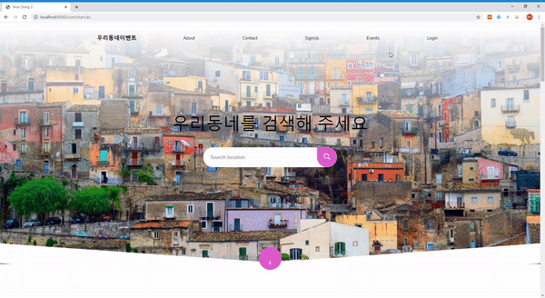

## SpringSecurity를 활용하여 로그인 성공 시 처리돼야 할 프로세스를 관리할 수 있다.

### 1. 로그인 성공 시 남아있는 에러세션을 삭제한다.
```
// 남아있는 에러세션이 있다면 지워준다.
protected void clearAuthenticationAttributes(HttpServletRequest request) {
  HttpSession session = request.getSession(false);
  if( session == null ) return ;

  session.removeAttribute(WebAttributes.AUTHENTICATION_EXCEPTION);
}
```
### 2. 로그인 성공 시 이동할 ReDirectURL을 설정한다.
```
	// redirectUrl 지정 메서드
	protected void resultRedirectStrategy(HttpServletRequest request, HttpServletResponse response) throws IOException, ServletException {
		SavedRequest savedRequest = requestCache.getRequest(request, response);
		if ( savedRequest != null ) {
			String targetUrl = savedRequest.getRedirectUrl();
			redirectStragtegy.sendRedirect(request, response, targetUrl);
		}else {
			redirectStragtegy.sendRedirect(request, response, defaultUrl);
		}
	}
```
- 로그인 화면을 보여주기 전 사용자 요청을 저장하고 꺼내올 수 있는 RequestCache 인터페이스를 활용하여, 이전 요청의 정보가 저장되어있다면 해당 정보를 참조하여 RedirectUrl로 이동한다.
- null인 경우에는 defaultUrl로 이동한다.

### 3. 로그인 성공 시 로그인 실패 횟수를 초기화한다.

#### 로그인 성공 후속처리 Class : [ [ LoginSuccessHandler ] ](https://github.com/Taesan94/OurNeighborhoodEvent/blob/master/src/main/java/woodong2/handler/security/LoginSuccessHandler.java)

### 결과확인

- 이전 요청정보가 저장되어 있는경우, 요청한 페이지로 이동한다.

- 이전 요청정보가 없는경우, defaultURL ( 메인페이지 )로 이동한다.


