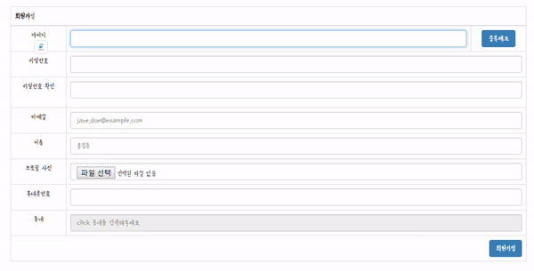

## Ajax를 활용하여 ID중복체크

- ajax소스코드

```
	function registerCheckFunction(){
		
		var userId = $('#userId').val();
		
		$.ajax({
			type : "POST",
			url : '/first/userInfos/duplicateCheck.do' ,
			data : { userId : userId },
			success : function(result){
				if ( result == 1 ){
					$('#checkMessage').html('사용할 수 없는 아이디입니다.');
					$('#checkType').attr('class' , 'modal-content panel-warning');
				}else{
					$('#checkMessage').html('사용할 수 있는 아이디입니다.');
					$('#checkType').attr('class' , 'modal-content panel-success');
				}
				$('#checkModal').modal("show"); 
			}
		})
	}
```

### 결과확인


