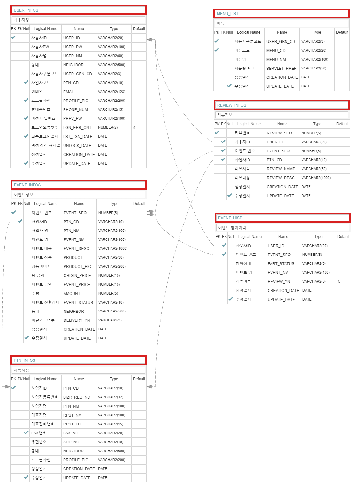

# OurNeighborhoodEvent

#### 프로젝트 version

#### IDE

#### Server
 

#### Language
 

#### Library & Framework
   

#### Issue
 

## 우리동네 이벤트란 ??

우리동네 이벤트는 자영업자들을 위한 효율적인 재고처리를 위하여 기획하게 되었습니다.
사장님 마음대로 우리동네에 이벤트( 가격할인 , 무료나눔 등 )를 등록하여 반복적인 일상에 소소한 즐거움을 줄 수 있기를 바랍니다.

## 프로젝트 구성

- 팀 구성 : 1인개발 ( 개인 프로젝트 )

- 개발일정 및 ISSUE내역
<table>
    <tr>
        <td>일정</td>
        <td>진행상황</td>
        <td>Issue</td>
    </tr>
    <tr>
        <td>1~3일차</td>
        <td>
            <ul>
                <li>필요기능 분석</li>
                <li>테이블 설계</li>
                <li>홈페이지 디자인 선정 및 Customizing</li>
            </ul>
        </td>
        <td>
            <ul>
                <li><a href="https://github.com/Taesan94/OurNeighborhoodEvent/issues/2"> [ 템플릿 적용 시 Issue 1 ] </a></li>
                <LI><a href="https://github.com/Taesan94/OurNeighborhoodEvent/issues/5"> [ 템플릿 적용 시 Issue 2 ] </a></li>
            </ul>
        </td>
    </tr>
    <tr>
        <td>4~6일차</td>
        <td>
            <ul>
                <li>개발 환경설정 및 DB연동</li>
                <li>로그인 및 회원가입 페이지 구현</li>
                <li>Header, Footer분리작업 수행</li>
                <li>다음주소 API적용</li>
            </ul>
        </td>
        <td>
            <ul>
                <li><a href="https://github.com/Taesan94/OurNeighborhoodEvent/issues/6"> [ 개발 환경구축 시 Issue ] </a></li>
            </ul>
        </td>
    </tr>
    <tr>
        <td>7~9일차</td>
        <td>
             <ul>
                <li>테이블 별 VO, DAO, Service, SQL Mapper파일 정의</li>
                <li>조회화면 구현</li>
                <li>Ajax적용</li>
                <li>유효성 검사 적용</li>
            </ul>
        </td>
        <td>
            <ul>
                <li><a href="https://github.com/Taesan94/OurNeighborhoodEvent/issues/7"> [ Ajax적용 시 Issue ] </a></li>
            </ul>
        </td>
    </tr>
    <tr>
        <td>10~14일차</td>
        <td>
            <ul>
                <li>가게등록, 리뷰등록, 이벤트등록 페이지 구현</li>
                <li>암호화적용 완료</li>
                <li>Interceptor적용</li>
                <li>유저구분코드에 따른 메뉴리스트 출력되도록 적용</li>
            </ul>
        </td>
        <td>
            <ul>
                <li><a href="https://github.com/Taesan94/OurNeighborhoodEvent/issues/8"> [ 구분에 따른 MenuList적용 시 Issue ] </a></li>
                <li><a href="https://github.com/Taesan94/OurNeighborhoodEvent/issues/10"> [ 가게등록 INSERT수행 시 Issue ] </a></li>
            </ul>
        </td>
    </tr>
    <tr>
        <td>15~17일차</td>
        <td>
            <ul>
                <li>페이징처리 적용</li>
                <li>개발내역 정리</li>
            </ul>
        </td>
        <td>
            <ul>
                <li><a href="https://github.com/Taesan94/OurNeighborhoodEvent/issues/11"> [ 페이징 처리 시 Issue ] </a></li>
            </ul>
        </td>
    </tr>
    <tr>
        <td>추가 1</td>
        <td>
            <ul>
                <li>SpringSecurity 적용</li>
                <li>SpringSecurity적용으로 대체가능한 기존기능 삭제</li>
            </ul>
        </td>
        <td>
            <ul>
                <li><a href="https://github.com/Taesan94/Spring/issues/4"> [ Security 의존성 주입 시 Issue ] </a></li>
                <li><a href="https://github.com/Taesan94/Spring/issues/5"> [ &lt;authentication-provider&gt;태그 설정오류로 인한 Issue ] </a></li>
            </ul>
        </td>
    </tr>
</table>

- 개발환경 Setting시 ISSUE 내역
<table>
    <tr>
        <td>분류</td>
        <td>제목</td>
        <td>조치사항</td>
    </tr>
    <tr>
        <td>개발환경 설정오류</td>
        <td>
            <ul>
                <li>프로젝트 Clone하여 생성 시 Maven관련 오류내역</li>
            </ul>
        </td>
        <td>
            <ul>
                <li><a href="https://github.com/Taesan94/OurNeighborhoodEvent/issues/12"> [ Library class not found ] </a></li>
                <li><a href="https://github.com/Taesan94/OurNeighborhoodEvent/issues/13"> [ Dynamic Web module 3.1 requires java 1.7 or newer ] </a></li>
            </ul>
        </td>
    </tr>
</table>

## ERD 및 테이블 설명

### 사용자정보(USER_INFOS)

    1) 사업자코드 ( PTN_CD )
    
    - 신규 사업자 등록 시 UPDATE , 최초 계정 등록시 NULL

    2) 로그인오류 횟수 ( LGN_ERR_CNT )
    
    - 로그인 실패 시 CNT증가, 5회실패시 계정 잠김
    - 로그인 성공 시 0으로 초기화

    3) 계정활성화여부 ( ENABLED )
    
    - 0은 false, 1은 true

### 계정권한정보(AUTHORITY)

    1) 권한 명 ( AUTHORITY_NAME )
    
    - USER_ID별 권한정보 등록
    - ROLE_NORMAL : 일반 사용자
    - ROLE_PARTNER : 파트너 등록 사용자
    - ROLE_ADMIN : 관리자

### 사업자정보( PTN_INFOS )

    1) 사업자ID ( PTN_CD )
    
    - PXXXXX 형태로 저장

### 이벤트정보( EVENT_INFOS )

    1) 이벤트번호 ( EVENT_SEQ )
    
    - EXXXXXX 형태로 저장

    2) 이벤트 진행상태 ( EVENT_STATUS )
    
    - WORK : 진행 중
    - END : 종료

    3) 배달가능 여부 ( DELIVERY_YN )
    
    - Y : 가능 , 이벤트 화면에서 오토바이 표시
    - N : 불가능

    4) 인덱스 : EVENT_INFOS_IDX01 (PTN_CD, EVENT_SEQ)
    
    - 용도 : 파트너 별로 진행 이벤트 내역을 조회하기 위함

### 이벤트 참여이력( EVENT_HIST )

    1) 참여상태 ( PART_STATUS )
    
    - COM : 결제완료
    - CAN : 결제취소
    - REDO : 취소 후 다시결제 ( 동일한 EVENT_SEQ,USER_ID로 CAN의 이력이 존재하는 경우 등록 됨 )

    2) 이벤트 진행상태 ( EVENT_STATUS )
    
    - WORK : 진행 중
    - END : 종료

### 리뷰정보 ( REVIEW_INFOS )

    1) 리뷰번호 ( REVIEW_SEQ )
    
    - RXXXXXX 형태로 저장
    
    2) 인덱스 : REVIEW_INFOS_IDX01(EVENT_SEQ, REVIEW_SEQ)
    
    - 용도 : 사업자 별로 최근 이벤트의 리뷰를 조회하기 위함
    
### * 사업자ID, 리뷰번호, 이벤트번호 채번쿼리 ( MAX+1 추출 )
    
    EX) 사업자ID 채번쿼리
    
    SELECT 'P' || LPAD(NVL(MAX(SUBSTR(PTN_CD,2)),0)+1,5,'0') 
    FROM PTN_INFOS
    
    
## 주요 기능

### 로그인 세션체크
 <a href="https://github.com/Taesan94/OurNeighborhoodEvent/blob/master/FunctionMD/Interceptor.md">Interceptor</a> 
 <a href="https://github.com/Taesan94/OurNeighborhoodEvent/blob/master/FunctionMD/Interceptor.md">[ SpringSecurity활용 ]</a>

### 페이징처리 기능
- <a href="https://github.com/Taesan94/OurNeighborhoodEvent/blob/master/FunctionMD/Paging.md">[ Paging ]</a>

### Pw암호화
 <a href="https://github.com/Taesan94/OurNeighborhoodEvent/blob/master/FunctionMD/Encrypt.md">[ SHA-256 ]</a> 
 <a href="https://github.com/Taesan94/OurNeighborhoodEvent/blob/master/FunctionMD/Encrypt.md">[ SpringSecurity활용 ]</a>

### 파일 업로드기능
<a href="https://github.com/Taesan94/OurNeighborhoodEvent/blob/master/FunctionMD/FileUpload.md">[ FileUpload ]</a>

### ID중복체크
<a href="https://github.com/Taesan94/OurNeighborhoodEvent/blob/master/FunctionMD/Validation.md">[ Validation ]</a> 

### 로그인 실패 에러메시지
 <a href="https://github.com/Taesan94/OurNeighborhoodEvent/blob/master/FunctionMD/Validation.md">[ request.SetAttribute방식 ]</a> 
 <a href="https://github.com/Taesan94/OurNeighborhoodEvent/blob/master/FunctionMD/Validation.md">[ SpringSecurity활용 ]</a>

### 다음주소 API를 활용한 주소검색
- <a href="https://github.com/Taesan94/OurNeighborhoodEvent/blob/master/FunctionMD/DaumAPI.md">[ DaumAPI ]</a>

### 개발환경 설정정보
- <a href="https://github.com/Taesan94/OurNeighborhoodEvent/blob/master/FunctionMD/DevConfig.md">[ DevConfig ]</a>

### BootStrap을 활용한 템플릿 적용하여 UI구현
- <a href="#screenshotStart">[ ScreenShot ]</a>

## 우리동네 이벤트 스크린샷

### 메인화면

- <a name="screenshotStart">최근 이벤트 및 리뷰조회</a>

### 이벤트조회

- 9개씩 페이징처리하여 조회

- 사진 클릭시 이벤트 상세 조회

- 상세내용 및 사업자의 리뷰내역 확인가능

### About

- 서비스 설명

### Contact

- 개발자 연락처

