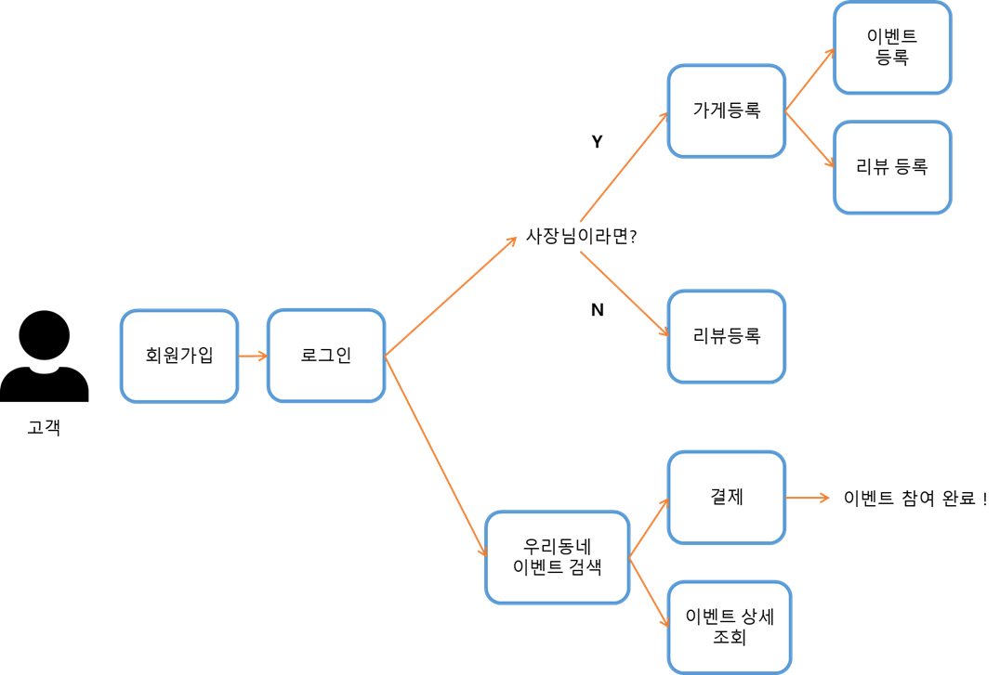
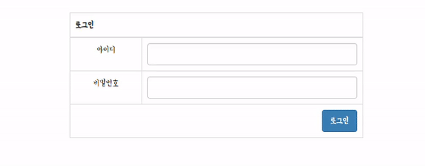
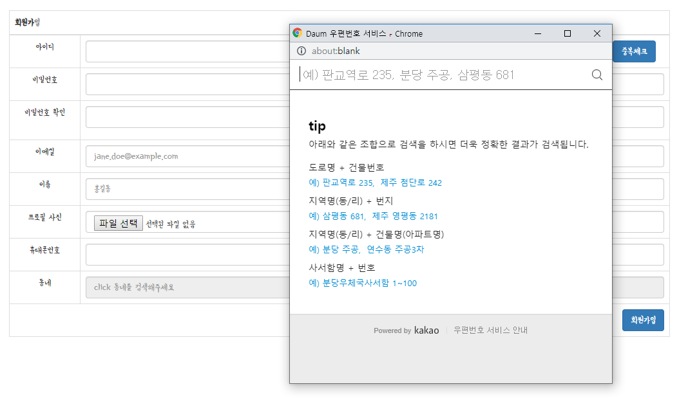
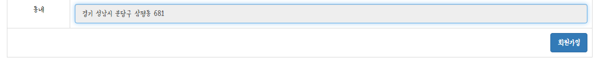
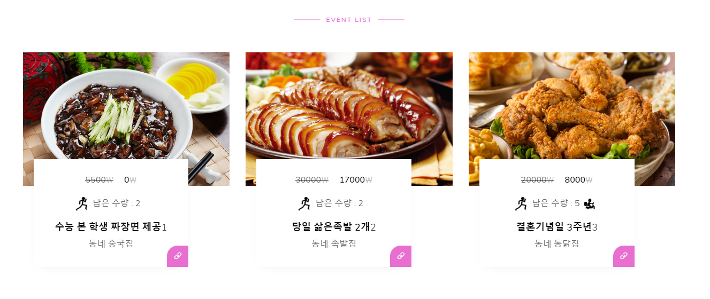
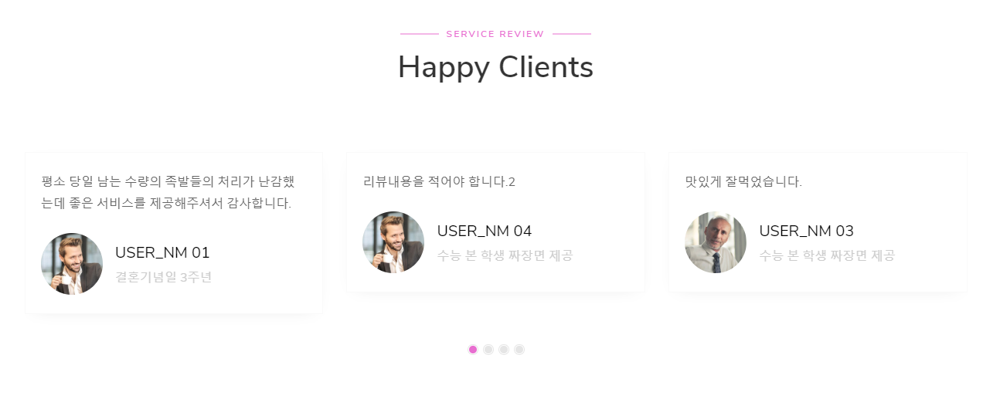

# OurNeighborhoodEvent

<p>
    
    
    
    
      
    
    
    
</p>

- **Ver. 1.0.0**
  - 결제서비스 연동을 제외한 기본 CRUD기능 구현 완료
  
## 우리동네 이벤트란 ??  

우리동네 이벤트는 자영업자들을 위한 효율적인 재고처리를 위하여 기획하게 되었습니다.
사장님 마음대로 우리동네에 이벤트( 가격할인 , 무료나눔 등 )를 등록하여 반복적인 일상에 소소한 즐거움을 줄 수 있기를 바랍니다.

## 서비스Flow


## ERD 및 테이블 설명


**1. 사용자정보(USER_INFOS) : 기본 계정정보 테이블**

- 사업자의경우에는 사업자 코드 함께 등록 됨
- 사용자구분코드에따른 메뉴리스트 구분 ( 일반:NOR, 사업자:PTN, 관리자:ADM )  

**2. 사업자정보 ( PTN_INFOS ) : 사업자 정보 테이블**  

**3. 이벤트정보( EVENT_INFOS ) : 이벤트 정보**  

- 이벤트 진행상태 ( 진행중: WORK, 종료:END )
- [ FK ] 이벤트 등록시 로그인 사업자계정의 사업자코드 참조 함.
- [ INDEX ] 사업자 별 매출을 조회할 수 있도록 PTN_CD,EVENT_SEQ로 INDEX를 구성 함.  

**4. 이벤트 참여이력 ( EVENT_HIST ) : 고객별 참여이벤트이력을 등록.**  

- 참여상태 ( 결제완료 : COM, 취소 : CAN, 취소 후 다시결제 : REDO )
- 리뷰여부 ( 리뷰작성 한 경우: Y, 작성 안 한 경우 : N , 이때 N은 Default 값 )
- [ FK ] 이벤트 가 종료(END)되었을 때 참여 한 계정의 ID와,등록 한 사업자 코드, 종료 된 이벤트 번호를 참조 함
- [ INDEX ] 이벤트 별 리뷰를 조회할 수 있도록 EVENT_SEQ, REVIEW_SEQ로 INDEX를 구성 함.  

**5. 리뷰정보 ( REVIEW_INFOS ) : 리뷰정보**  

**6. 메뉴 ( MENU_LIST ) : 계정의 사용자구분코드에 따른 메뉴구성**  

- 일반(NOR) : 리뷰등록
- 사업자(PTN) : 리뷰등록, 이벤트등록, 가게정보수정
- 관리자(ADM) : 리뷰관리, 이벤트관리  

## 주요 기능

**1. 회원가입**

- 저장 시 PW 암호화 ( SHA-256 )
- 프로필사진 업로드기능
- 동네 정보 등록 시 다음 주소 API 활용
- Ajax를 활용한 ID중복체크

**2. 로그인**  

- 유효성 체크
- 비밀번호 3회 이상 실패 시 캡챠화면 구현
- Interceptor를 활용한 Session관리

**3. 메인페이지**  

- 최근 이벤트 목록3 건 조회
- 최초 접속 시 최근 등록리뷰 3건 조회 ( 동네와 상관없이 )
- 동네 검색 시 동네의 최근 이벤트 3건 조회 ( 1건도 없으면 alert 이후에 default 이미지 )  

**4. 이벤트**  

- 사업자등록이 되어있는 계정만 등록 가능
- 이벤트 등록 시 이미지 업로드 ( 없으면 default 이미지 )
- 이벤트 상세목록 조회, 삭제, 등록  

**5. 동네 검색**  

- 다음 주소 API 활용  

## 주요 소스코드

**1.Bootstrap을 활용한 템플릿 적용하여 메인사이트 UI구현**


**2. Ajax를 활용한 유효성 검사**

- ID중복체크


- 로그인시 유효성 검사




**3. 다음주소 API를 활용한 동네검색** <br>
: 최초 회원가입시 도로명 주소로 등록. 메인페이지에서 동네조회시 도로명 주소로만 조회 가능하도록 함.

- 동네검색


- 동네선택


**4. 메인페이지 호출시 최신데이터 조회**

- 최근이벤트 3건 조회<br>
: 현재 진행중인(WORK) 이벤트 중에서 최신3건 조회.


- 수행 SQL
```
SELECT
EVENT_SEQ,PTN_NM,EVENT_NM,PRODUCT_PIC,ORIGIN_PRICE,EVENT_PRICE,AMOUNT,NEIGHBOR,DELIVERY_YN
FROM EVENT_INFOS
WHERE EVENT_STATUS ='WORK'
ORDER BY EVENT_SEQ DESC;
```

- 최신등록 리뷰순으로 데이터 조회<br>
: 종료 된 이벤트를 기준으로, EVENT_SEQ로 이벤트정보, USER_ID로 고객정보를 조회함 ( 3개 테이블 조인 )


- 수행 SQL
```
SELECT USER_NM, PROFILE_PIC, EH.EVENT_NM AS EVENT_NM, REVIEW_DESC AS REVIEW_DESC
FROM REVIEW_INFOS RV , USER_INFOS UI , EVENT_HIST EH
WHERE EH.PART_STATUS = 'COM'
AND RV.EVENT_SEQ = EH.EVENT_SEQ
AND RV.USER_ID = UI.USER_ID
ORDER BY RV.REVIEW_SEQ DESC
```

**5. 로그인 계정 등급에 따른 메뉴리스트 조회**
( 데이터 첨부 )
( 소스코드 첨부 - 세션을 LIST로 관리하여.. )
( 결과 첨부 )


