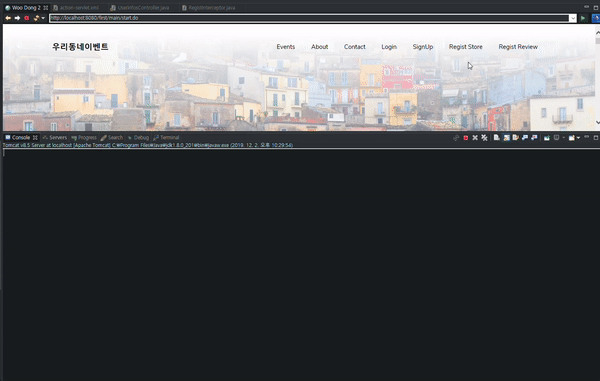
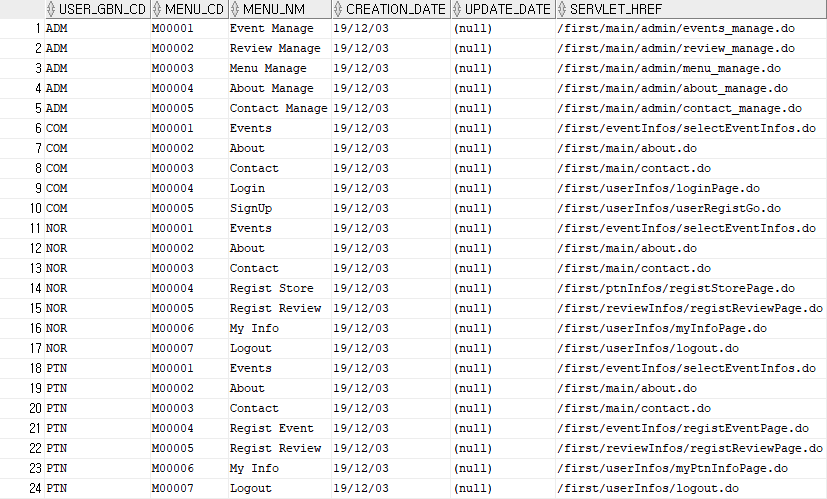

# OurNeighborhoodEvent

<p>
    
    
    
    
      
    
    
    
</p>

- **Ver. 1.0.0**
  - 기본 CRUD기능 적용
  - 결제서비스는 연동 미구현
  
  
## 우리동네 이벤트란 ??  

우리동네 이벤트는 자영업자들을 위한 효율적인 재고처리를 위하여 기획하게 되었습니다.
사장님 마음대로 우리동네에 이벤트( 가격할인 , 무료나눔 등 )를 등록하여 반복적인 일상에 소소한 즐거움을 줄 수 있기를 바랍니다.

## 서비스Flow


## ERD 및 테이블 설명


**1. 사용자정보(USER_INFOS) : 기본 계정정보 테이블**

- 사업자의경우에는 사업자 코드 함께 등록 됨
- 사용자구분코드에따른 메뉴리스트 구분 ( 일반:NOR, 사업자:PTN, 관리자:ADM )  

**2. 사업자정보 ( PTN_INFOS ) : 사업자 정보 테이블**  

**3. 이벤트정보( EVENT_INFOS ) : 이벤트 정보**  

- 이벤트 진행상태 ( 진행중: WORK, 종료:END )
- [ FK ] 이벤트 등록시 로그인 사업자계정의 사업자코드 참조 함.
- [ INDEX ] 사업자 별 매출을 조회할 수 있도록 PTN_CD,EVENT_SEQ로 INDEX를 구성 함.  

**4. 이벤트 참여이력 ( EVENT_HIST ) : 고객별 참여이벤트이력을 등록.**  

- 참여상태 ( 결제완료 : COM, 취소 : CAN, 취소 후 다시결제 : REDO )
- 리뷰여부 ( 리뷰작성 한 경우: Y, 작성 안 한 경우 : N , 이때 N은 Default 값 )
- [ FK ] 이벤트 가 종료(END)되었을 때 참여 한 계정의 ID와,등록 한 사업자 코드, 종료 된 이벤트 번호를 참조 함
- [ INDEX ] 이벤트 별 리뷰를 조회할 수 있도록 EVENT_SEQ, REVIEW_SEQ로 INDEX를 구성 함.  

**5. 리뷰정보 ( REVIEW_INFOS ) : 리뷰정보**  

**6. 메뉴 ( MENU_LIST ) : 계정의 사용자구분코드에 따른 메뉴구성**  

- 일반(NOR) : 리뷰등록, 개인정보수정
- 사업자(PTN) : 리뷰등록, 이벤트등록, 가게정보수정
- 관리자(ADM) : 메뉴관리 가능
- 공통(COM) : 비 로그인시 기본 메뉴

## 주요 기능

**1. 회원가입**

- 저장 시 PW 암호화 ( SHA-256 )
- 프로필사진 업로드기능
- 동네 정보 등록 시 다음 주소 API 활용
- Ajax를 활용한 ID중복체크

**2. 로그인**  

- 유효성 체크
- 비밀번호 3회 이상 실패 시 캡챠화면 구현

**3. 메인페이지**  

- 최근 이벤트 목록3 건 조회
- 최초 접속 시 최근 등록리뷰 3건 조회 ( 동네와 상관없이 )
- 동네 검색 시 동네의 최근 이벤트 3건 조회 ( 1건도 없으면 alert 이후에 default 이미지 )  

**4. 이벤트**  

- 사업자등록이 되어있는 계정만 등록 가능
- 이벤트 등록 시 이미지 업로드 ( 없으면 default 이미지 )
- 이벤트 상세목록 조회, 삭제, 등록  

**5. 동네 검색**  

- 다음 주소 API 활용  

## 개발내역

**1.Bootstrap을 활용한 템플릿 적용하여 메인사이트 UI구현**

- mainPage<br>
: 메인페이지, 최근 이벤트 및 리뷰조회, 우리동네 이벤트 검색가능


- Events<br>

1) 이벤트 리스트 조회<br>
: 한 page 최대 9개 조회, 이후 페이징 처리


<br>

2) 이벤트 상세 조회<br>
: 상세내역 조회, 이벤트 설명 및 이벤트 사업자의 최근후기 조회가능


- About<br>
: 서비스 설명을위한 페이지


**2. Ajax를 활용한 유효성 검사**

- ID중복체크


- 로그인시 유효성 검사


- 회원가입 및 로그인시 PW암호화 적용 ( SHA-256 )

- 암호화 적용 메소드 : public String makeEncrypt(String msg)
https://github.com/Taesan94/OurNeighborhoodEvent/blob/master/src/main/java/first/actions/CommonFunctions.java

- [ PW : 123 ] 입력 후 수행 insert쿼리 확인


**3. 다음주소 API를 활용한 동네검색** <br>
: 최초 회원가입시 도로명 주소로 등록. 메인페이지에서 동네조회시 도로명 주소로만 조회 가능하도록 함.

- 동네검색


- 동네선택


**4. 메인페이지 호출시 최신데이터 조회**

- 최근이벤트 3건 조회<br>
: 현재 진행중인(WORK) 이벤트 중에서 최신3건 조회.


- 수행 SQL
```
SELECT
EVENT_SEQ,PTN_NM,EVENT_NM,PRODUCT_PIC,ORIGIN_PRICE,EVENT_PRICE,AMOUNT,NEIGHBOR,DELIVERY_YN
FROM EVENT_INFOS
WHERE EVENT_STATUS ='WORK'
ORDER BY EVENT_SEQ DESC;
```

- 최신등록 리뷰순으로 데이터 조회<br>
: 종료 된 이벤트를 기준으로, EVENT_SEQ로 이벤트정보, USER_ID로 고객정보를 조회함 ( 3개 테이블 조인 )


- 수행 SQL
```
SELECT USER_NM, PROFILE_PIC, EH.EVENT_NM AS EVENT_NM, REVIEW_DESC AS REVIEW_DESC
FROM REVIEW_INFOS RV , USER_INFOS UI , EVENT_HIST EH
WHERE EH.PART_STATUS = 'COM'
AND RV.EVENT_SEQ = EH.EVENT_SEQ
AND EH.USER_ID = RV.USER_ID
AND RV.USER_ID = UI.USER_ID
ORDER BY RV.REVIEW_SEQ DESC
```
**5. 이벤트등록,가게등록,리뷰등록 페이지 수행시 로그인 세션 처리를 위하여 InterCeptor활용**

1) action-servlet.xml 에서 등록페이지 서블릿 네임 패턴 호출 시 로그인세션이 살아있지않으면 로그인 후 이용가능하도록 처리

```
<mvc:interceptor>
	<mvc:mapping path="/*/regist*Page.do" />
	<bean id="registInterCeptor" class="first.common.interceptors.RegistInterceptor"></bean>
</mvc:interceptor>
```

2) 수행되는 preHandle메소드 정의

```
public class EventsInterceptor extends HandlerInterceptorAdapter {
	protected Log log = LogFactory.getLog(EventsInterceptor.class);

	@Override
	public boolean preHandle(HttpServletRequest request, HttpServletResponse response, Object handler)
			throws Exception {
		
		log.debug("====================================== 등록 전 로그인 Check preHandle ======================================");

		HttpSession session = request.getSession();
		
		// 세션에서 login Check
		Object obj = session.getAttribute("login");

		if ( obj == null ){
			// 비 로그인시 로그인 화면으로 이동
			response.sendRedirect("/first/userInfos/loginPage.do");
			return false; // 더이상 컨트롤러 요청으로 가지 않도록 false로 반환함
		}

		// return 값 true = 컨트롤러 요청 URI로 감, false = 가지 않음.
		return true;
	}
```

3) 수행확인, 비로그인시 registStorePage.do 가 호출되면 login페이지로 가이딩 됨.



**6. 로그인 계정 등급에 따른 메뉴리스트 조회**

- Menu_List테이블 데이터 구성



- 계정등급에 따른 메뉴리스트 출력<br>

1) 비 로그인시 'COM'의 메뉴리스트를 List형태로 Session에 보관.<br><br>
2) 로그인시 기존의 Session정보 삭제 후, 로그인 계정의 USER_GBN_CD값에 해당하는 메뉴리스트로 다시 Session재구성<br><br>

* 메뉴리스트를 List타입으로 보관하기위해 수행되는 method
```
	private List<MenuList> makeMenu(List<Map<String, MenuList>> menuList){
		
		List<MenuList> m = new ArrayList<MenuList>();

		for ( int i = 0; i < menuList.size(); i ++ ) {

			Map<String,MenuList> menus = menuList.get(i);

			Iterator itr = menus.values().iterator();

			MenuList menu = new MenuList();

			while ( itr.hasNext()) {
				menu.setMenuNm((String)itr.next());
				menu.setServletHref((String)itr.next());
			}

			m.add(menu);
		}
		
		return m;
	}
```

* 위의 method를 활용하여 session에 List로 데이터를 저장
```
		List<Map<String, MenuList>> menuList= null ;

		menuList = menuListService.selectMenu("COM"); //비 로그인시
		
		List<MenuList> m = makeMenu(menuList);
		
		request.setAttribute("menuList", m);
```        


* 등록 된 Session의 데이터로 header를 구성
```
    <div class="collapse navbar-collapse" id="ftco-nav">
        <ul class="navbar-nav ml-auto">
            <c:forEach var="row" items="${menuList}">
                <li class="nav-item"><a href=${ row.servletHref } class="nav-link">${ row.menuNm }</a></li>
            </c:forEach>
        </ul>
    </div>
```

- 'NOR'등급의 계정으로 로그인 시 메뉴리스트 변경결과 확인


**7. 파일업로드 기능**

1. pom.xml에 파입업로드를 위한 라이브러리설정 추가.

2. action-sevlet.xml에 CommonsMultipartResolver클래스를 사용하기 위한 beand_id 설정 추가.

3. 회원가입,가게등록,이벤트등록을위한 form태그의 enctype="multipart/form-data"로 지정.
	
4. 각각의 model클래스에 form태그에서 데이터를 받아오기 위한 MultipartFile타입의 변수추가.

5. 파일명 중복을 예방하기위해 현재시간을 기준으로 파일명을 생성.

6. FileOutputStream클래스를 활용하여 지정한 dir에 파일업로드 수행.

7. 업로드 파일의 절대경로를 DB의 올바른 컬럼에 INSERT수행.

8. DB의 데이터를 활용하여 서버에저장된 img파일을 참조하도록 관련 .jsp파일 수정

5~7 관련 메소드 : public String restore(MultipartFile multipartFile)
: https://github.com/Taesan94/OurNeighborhoodEvent/blob/master/src/main/java/first/actions/CommonFunctions.java
