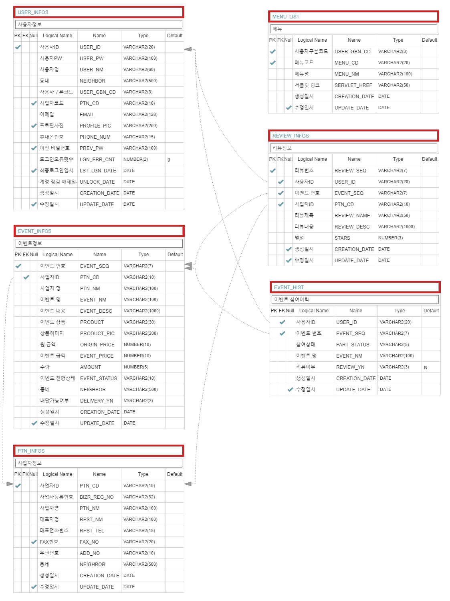

# OurNeighborhoodEvent

    
    
    
    
      
    
    
    

 
## 우리동네 이벤트란 ??  
 
우리동네 이벤트는 자영업자들을 위한 효율적인 재고처리를 위하여 기획하게 되었습니다.
사장님 마음대로 우리동네에 이벤트( 가격할인 , 무료나눔 등 )를 등록하여 반복적인 일상에 소소한 즐거움을 줄 수 있기를 바랍니다.
 
  
## ERD 및 테이블 설명
 

 
### 1. 사용자정보(USER_INFOS)
 

1-1) 사용자구분코드( USER_GBN_CD )
 

- NOR(일반유저) : 가게등록 및 이벤트 참여가능.

- PTN(사업자) : 이벤트 등록 및 참여가능

- ADM(관리자) : 사이트 관리가능

 
1-2) 사업자코드 ( PTN_CD )
 

- 신규 사업자 등록 시 UPDATE , 최초 계정 등록시 NULL

 
1-3) 로그인오류 횟수 ( LGN_ERR_CNT )
 

- 로그인 실패 시 CNT증가

- 로그인 성공 시 0으로 초기화

 
1-4) 최종로그인 일시 ( LST_LGN_DATE )
 

- 로그인 5회이상 실패시 SYSDATE로 UPDATE

- 24시간이 지난 후 최초로그인 성공 시 NULL로 UPDATE 수행

 
### 2. 사업자정보( PTN_INFOS )

 
2-1) 사업자ID ( PTN_CD )
 

- PXXXXX 형태로 저장

 
### 3. 이벤트정보( EVENT_INFOS )
 
 
3-1) 이벤트 번호( EVENT_SEQ )
 

- EXXXXXX 형태로 저장

 
3-2) 이벤트 진행상태 ( EVENT_STATUS )
 
- WORK : 진행 중

- END : 종료

 
3-3) 배달가능 여부 ( DELIVERY_YN )
 

- Y : 가능 , 이벤트 화면에서 오토바이 표시

- N : 불가능

 
3-4 ) 인덱스 : EVENT_INFOS_IDX01(PTN_CD, EVENT_SEQ)
 

- 용도 : 파트너 별로 진행 이벤트 내역을 조회하기 위함

 
### 4. 이벤트 참여이력( EVENT_HIST )
 

4-1) 참여상태( PART_STATUS )
 

- COM : 결제완료

- CAN : 결제취소

- REDO : 취소 후 다시결제 ( 동일한 EVENT_SEQ,USER_ID로 CAN의 이력이 존재하는 경우 등록 됨 )

 
4-2) 이벤트 진행상태 ( EVENT_STATUS )
 

- WORK : 진행 중

- END : 종료

 
### 5. 리뷰정보 ( REVIEW_INFOS )
 

5-1) 리뷰 번호( REVIEW_SEQ )
 

- RXXXXXX 형태로 저장

 
### 6. 메뉴 ( MENU_LIST )
 

6-1) 사용자구분코드 ( USER_GBN_CD )
 

- 로그인 계정의 USER_GBN_CD에 따른 메뉴리스트 출력

- 비 로그인(COM) : 로그인, 회원가입 메뉴

- 일반(NOR) : 사업자등록, 이벤트참여

- 사업자(PTN) : 리뷰등록, 이벤트등록, 이벤트참여

- 관리자 : 메뉴관리, 리뷰관리, 이벤트관리

6-2) 메뉴코드 ( MENU_CD )
 

- 사용자구분코드 별로 MENU_CD 존재

6-3) 서블릿 링크 ( SERVLET_HREF )
 

- 해당 메뉴호출 시 수행되는 Servlet정보

 
## 주요 기능
 

